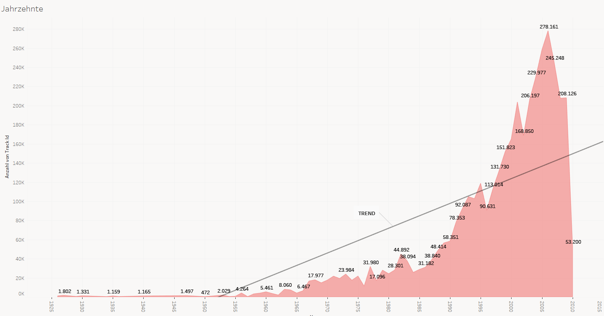

#### Aufgabe 1

Wir haben die Joins nach folgendem Schema durchgeführt:


Beide Joins wurden über die Track Id durchgeführt:


#### Aufgabe 2

###### Skalierung:

Die Daten werden von Tableau in zwei Kategorien eingeteilt: Dimensionen und Maßzahlen. Innerhalb der Variablen der Dimensions-Kategorie sind die kategorialen Merkmale (qualitativen), nach denen sich z.B. gut aggregieren lässt. Bei den Maßzahlen handelt es sich um metrisch Skalierte (quantitative) Variablen.

###### Missing Values

Obwohl es in Tableau möglich ist, sich fehlende Werte anzeigen zu lassen (z.B. über die folgende Darstellung), handelt es sich bei dem Tool eher um ein Visualisierungstool und die Analyse von Missings müsste für jede Variable einzeln mittels Grafik durchgeführt werden.


Für eine schnellere Analyse der Missing-Data haben wir uns mittels R einen schnellen Überblick verschafft:

``` {r eval=FALSE}
require(data.table)

missing_names <- c("Variable","NA_count","empty_string_count", "0_count" )

setwd("C:\\Users\\rudol\\Documents\\AAA_Wichtig\\STUDIUM\\MSc. Data Science\\2. Semester\\Big_Data_Analytics\\Datasets")


# Anzahl Missing Values im TimbreDatensatz:

timbres <- as.data.frame(fread("msd10k_timbre.tsv"))

timbre_missings <- data.frame (names(timbres))

timbre_missings <- cbind(timbre_missings,sapply(timbres, function(x) sum(is.na(x))))
timbre_missings <- cbind(timbre_missings,sapply(timbres, function(x) sum(x=="")))
timbre_missings <- cbind(timbre_missings,sapply(timbres, function(x) sum(x==0)))

# Spaltennamen
names(timbre_missings) <- missing_names

# Anzahl Missing Values im MetaDatensatz (some  + more enthalten viele Redundanzen, daher hier nur "more"):

meta_data <- as.data.frame(fread("msd10k_more_metadata.tsv"))

# Anzahl Missing Values im TimbreDatensatz:

meta_data_missings <- data.frame (names(meta_data))

meta_data_missings <- cbind(meta_data_missings,sapply(meta_data, function(x) sum(is.na(x))))
meta_data_missings <- cbind(meta_data_missings,sapply(meta_data, function(x) sum(x=="")))
meta_data_missings <- cbind(meta_data_missings,sapply(meta_data, function(x) sum(x==0)))

# Spaltennamen
names(meta_data_missings) <- missing_names
```

Hier ist das Ergebnis abgebildet:

Timbre_Daten:


Meta_Daten:


###### Diagramm mit Jahreszahlen

Nach herausfiltern der "überflüssigen" Nullwerte (Jahr==0) sind wir auf folgende Übersicht über die Jahrzente gekommen:

Insgesamt:



In Prozent:


###### Weitere Fragestellungen:

>1. Woher kommen die meisten Künstler?
>2. Sind die Lieder im Laufe der Zeit kürzer oder länger geworden?
>3. Sind schnelle Songs beliebter als langsame Songs?

Zu 1.)

Wir sehen hier, dass viele Künstler aus den USA und Nord/West-Europa liegen. Auffällig ist, dass Asien (Russland, China, Indien) trotz hoher Bevölkerungszahl in diesen Daten fast gar nicht vertreten ist. Wurden hier eventuell nur englische Lieder in der Datenbank eingetragen?


Zu 2.)

Tatsächlich scheint es, dass im Laufe der Zeit die (durchschnittliche) Länge der Lieder zugenommen hat, sich aber während der letzten Jahrzente etwas eingependelt hat bei ca. 280 Sekunden (4 Minuten, 40 Sekunden)


Zu 3.)

Leider lässt sich die Frage nur schwer beantworten. Es scheint logisch, dass weder zu langsame, noch zu schnelle Songs zu den beliebtesten zählen. Eine Tendenz lässt sich eher nicht erkennen. Auf dieser Abbildung entspricht jeder Punkt einem Songtitel:


#### Aufgabe 3

