# BDA, Praktikumsbericht 1

Gruppe mi6xc: Alexander Kniesz, Maximilian Neudert, Oskar Rudolf

---

<script type="text/javascript" src="http://cdn.mathjax.org/mathjax/latest/MathJax.js?config=TeX-AMS-MML_HTMLorMML"></script>
<script type="text/x-mathjax-config">
    MathJax.Hub.Config({ tex2jax: {inlineMath: [['$', '$']]}, messageStyle: "none" });
</script>

## Aufgabe 1

Zuerst haben wir ein gemeinsames Notebook [bericht1](https://141.100.62.87:7070/#/notebook/2EB5CTTRT) auf Zeppelin mit Ownern aller Gruppenmitgliedern erstellt, auf dem wir gemeinsam arbeiten können.

Wir haben als ApplicationID `app-20190425183601-0341` erhalten und uns auf `http://141.100.62.85:8080/` die Ressourcen angeschaut. Auffällig war, dass keine Kerne zugewiesen waren. Wenn man Testweise eine Endlosschleife mit PySpark ausgeführt hat, dann ging der Status auf Waiting. Wir sind von dem Monitor noch nicht ganz überzeugt. Der Status wirkt ziemlich träge. Aber man kann damit gut Applications abschießen die in Jobs festhängen.

Zuerst haben wir uns alle Million Song relevanten Tabellen ausgeben lassen:

```python
%pyspark
spark.sql("show tables like 'msd10k*'").show(truncate=False)
```


Dann haben wir die Daten gesichtet:

```sql
%sql
select * from msd10k_timbre limit 100
select * from msd10k_some_metadata limit 100
select * from msd10k_more_metadata limit 100
```


Wir haben vorerst geprüft, ob die Timbre überall gleich lang sind

```python
%pyspark
s1 = 'TRAVHPV128F933E986'
s2 = 'TRAKXYJ128F42525ED'
def get_tdur(track_id):
    not_sql_df = spark.sql("select count(timbre_0) as val from msd10k_timbre where track_id = '{}'".format(track_id))
    s_tcount = not_sql_df.collect()[0]['val']
    not_sql_df = spark.sql("select duration as dur from msd10k_more_metadata where track_id = '{}'".format(track_id))
    s_duration = not_sql_df.collect()[0]['dur']
    timbre_duration = s_duration / s_tcount
    return timbre_duration

d1 = get_tdur(s1)
d2 = get_tdur(s2)

print(d2 - d1)
```

Wir haben `0.0299464126059322` als Ergebnis bekommen, was bedeutet, dass die Timbre nicht gleich lang sind.

Beispielhaft lassen wir uns für `duration` und `loudness` eine statistische Zusammenfassung mittels `describe()` geben:

```python
%pyspark
df = spark.sql("select duration,loudness from msd10k_some_metadata")
df.describe().show()
```


Beim Vergleich der Performance haben wir durch Sichtprüfung mehrer runs einmal mit `describe` einmal mit Aggregationsfunktionen column based und row based verglichen und kamen zum Ergebnis, dass row based langsamer läuft.


## Aufgabe 2

### a)

Wir haben die Joins nach folgendem Schema durchgeführt:

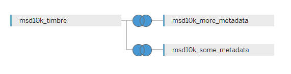

Beide Joins wurden über die Track Id durchgeführt:

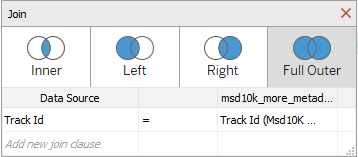

### b)

#### Skalierung

Die Daten werden von Tableau in zwei Kategorien eingeteilt: Dimensionen und Maßzahlen. Innerhalb der Variablen der Dimensions-Kategorie sind die kategorialen Merkmale (qualitativen), nach denen sich z.B. gut aggregieren lässt. Bei den Maßzahlen handelt es sich um metrisch Skalierte (quantitative) Variablen.

#### Missing Values

Obwohl es in Tableau möglich ist, sich fehlende Werte anzeigen zu lassen (z.B. über die folgende Darstellung), handelt es sich bei dem Tool eher um ein Visualisierungstool und die Analyse von Missings müsste für jede Variable einzeln mittels Grafik durchgeführt werden.

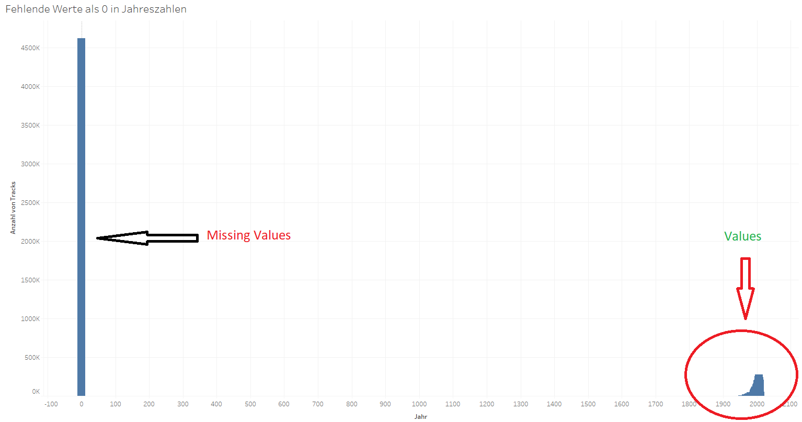

Für eine schnellere Analyse der Missing-Data haben wir uns mittels R einen schnellen Überblick verschafft:

```{r eval=FALSE}
require(data.table)

missing_names <- c("Variable","NA_count","empty_string_count", "0_count" )

setwd("C:\\Users\\rudol\\Documents\\AAA_Wichtig\\STUDIUM\\MSc. Data Science\\2. Semester\\Big_Data_Analytics\\Datasets")


# Anzahl Missing Values im TimbreDatensatz:

timbres <- as.data.frame(fread("msd10k_timbre.tsv"))

timbre_missings <- data.frame (names(timbres))

timbre_missings <- cbind(timbre_missings,sapply(timbres, function(x) sum(is.na(x))))
timbre_missings <- cbind(timbre_missings,sapply(timbres, function(x) sum(x=="")))
timbre_missings <- cbind(timbre_missings,sapply(timbres, function(x) sum(x==0)))

# Spaltennamen
names(timbre_missings) <- missing_names

# Anzahl Missing Values im MetaDatensatz (some  + more enthalten viele Redundanzen, daher hier nur "more"):

meta_data <- as.data.frame(fread("msd10k_more_metadata.tsv"))

# Anzahl Missing Values im TimbreDatensatz:

meta_data_missings <- data.frame (names(meta_data))

meta_data_missings <- cbind(meta_data_missings,sapply(meta_data, function(x) sum(is.na(x))))
meta_data_missings <- cbind(meta_data_missings,sapply(meta_data, function(x) sum(x=="")))
meta_data_missings <- cbind(meta_data_missings,sapply(meta_data, function(x) sum(x==0)))

# Spaltennamen
names(meta_data_missings) <- missing_names
```

Hier ist das Ergebnis abgebildet:

Timbre_Daten:
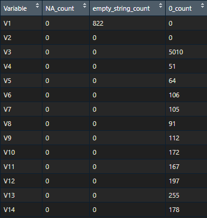

Meta_Daten:
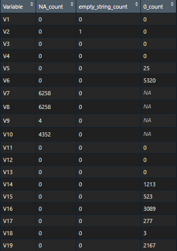

#### Diagramm mit Jahreszahlen

Nach herausfiltern der "überflüssigen" Nullwerte (Jahr==0) sind wir auf folgende Übersicht über die Jahrzente gekommen:

Insgesamt:

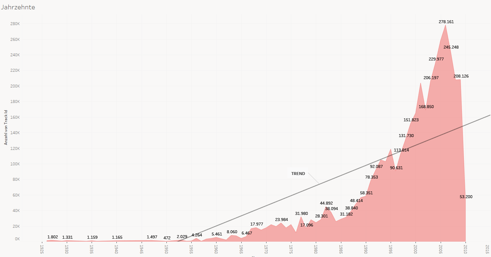

In Prozent:

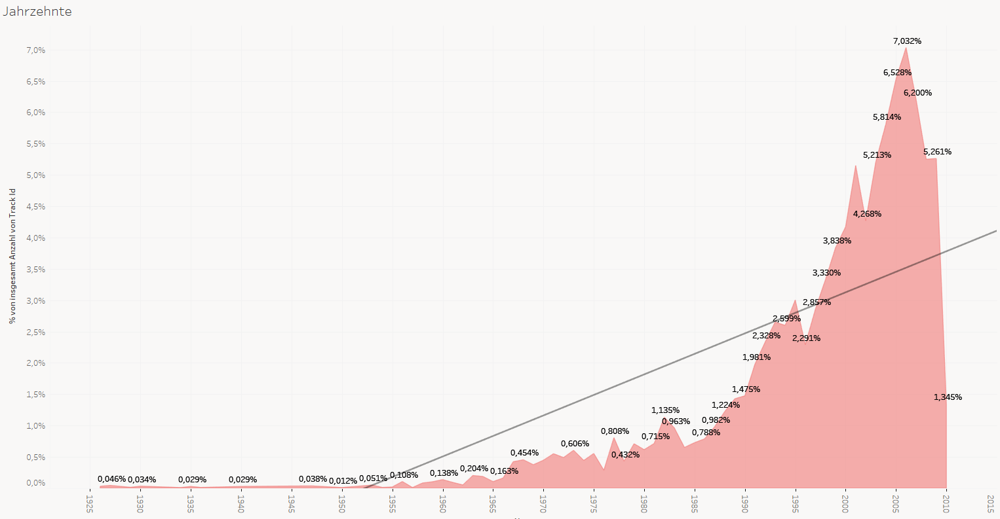

#### Weitere Fragestellungen

1. Woher kommen die meisten Künstler?
2. Sind die Lieder im Laufe der Zeit kürzer oder länger geworden?
3. Sind schnelle Songs beliebter als langsame Songs?

Zu 1.)

Wir sehen hier, dass viele Künstler aus den USA und Nord/West-Europa liegen. Auffällig ist, dass Asien (Russland, China, Indien) trotz hoher Bevölkerungszahl in diesen Daten fast gar nicht vertreten ist. Wurden hier eventuell nur englische Lieder in der Datenbank eingetragen?

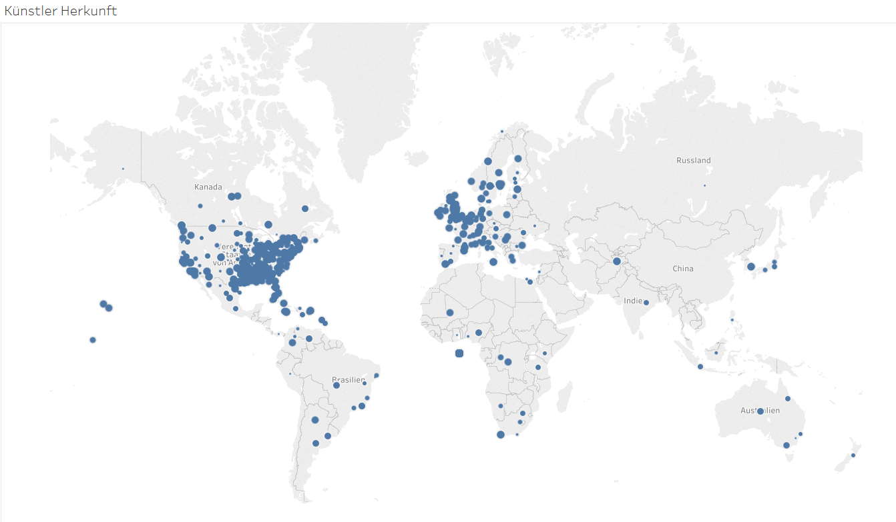

Zu 2.)

Tatsächlich scheint es, dass im Laufe der Zeit die (durchschnittliche) Länge der Lieder zugenommen hat, sich aber während der letzten Jahrzente etwas eingependelt hat bei ca. 280 Sekunden (4 Minuten, 40 Sekunden)

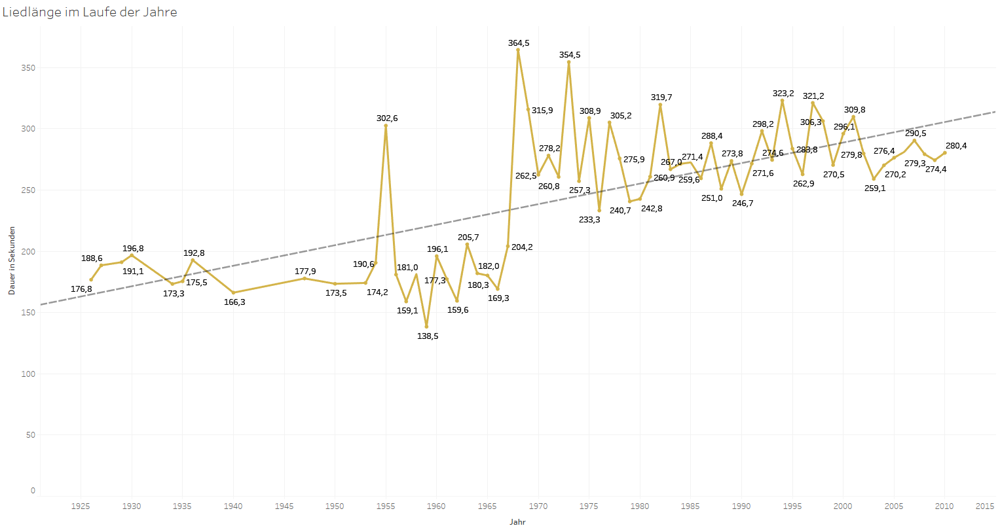

Zu 3.)

Leider lässt sich die Frage nur schwer beantworten. Es scheint logisch, dass weder zu langsame, noch zu schnelle Songs zu den beliebtesten zählen. Eine Tendenz lässt sich eher nicht erkennen. Auf dieser Abbildung entspricht jeder Punkt einem Songtitel:

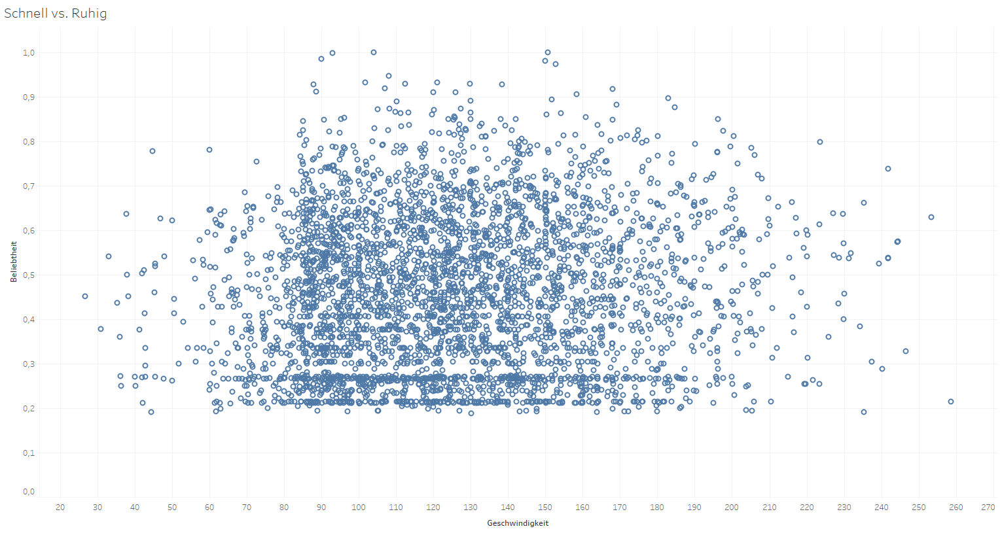

## Aufgabe 3

Für das Binning haben wir 10 bins gewählt, diese mit PySpark erstellt und und exemplarisch die Tabelle zeigen lassen. Wir haben festgestellt, dass der Bucketizer binning betreibt, indem dieser eine Spalte hinzufügt, in der die Zuordnung zu einem bin steht.


Gespeichert haben wir die Tabelle dann als `mi6xc_bucketeddata` und zur Sicherheit den Speichervorgang überprüft.


Anschließend haben wir die Pivotierung mittels Aggregation über die Anzahl durchgeführt und die Spalten danach in eine relative Maßzahl umgewandelt, was uns die Profil-Vektoren gibt.


## Aufgabe 4

Die einzelnen bins enthalten nun die relative Häufigkeit der einzelnen loudness Segmente. Zur Sichtung kann man diese als Spalte nehmen und über die `track_id` auftragen.
Wir habe eine Spalte `score` in Tableau erstellt, die einen loudness score nach folgender Formel berechnet:

$$
score = 1 \cdot bin_1 + 2 \cdot bin_2 + 3 \cdot bin_3 + \dots + 8 \cdot bin_8
$$

Der errechnete Score gibt einen Wert wieder, mit welchem sich der Anteil an lauten Segmenten vergleichen lässt. Die Faktoren bei der Berechnung dienen als Gewichte, sodass $bin_1$ als "leistestem" Bin das kleinste Gewicht und $bin_8$ als "lautestem" Bin das größte Gewicht zugeordnet wird.

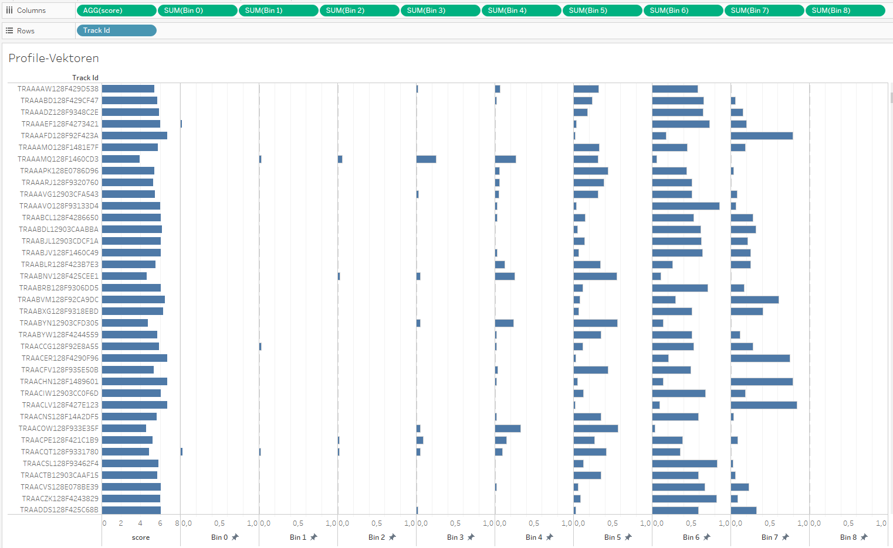

Wenn wir nun über den score absteigend sortieren, finden wir laute Songs. Sortieren wir aufsteigend, so finden wir leise Songs.

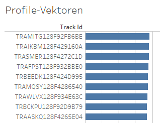
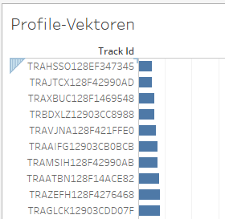

Da die Songs nach unserem Wissensstand von unterschiedlichen Plattformen stammen und daher einen unterschiedlichen "replay gain" haben können, bietet es sich an, Spotify für einen akustischen Vergleich heranzuziehen. Einige Songs lassen sich problemlos auf Spotify finden. Der Webplayer von Spotify nutzt nach Aussagen der FAQ keine "loudness normalization", wodurch eine vernünftige Testumgebung zum Hörvergleich gegeben ist.

Im Folgenden haben wir also mittels pySpark einen lauten und einen leisen Tracks identifiziert...

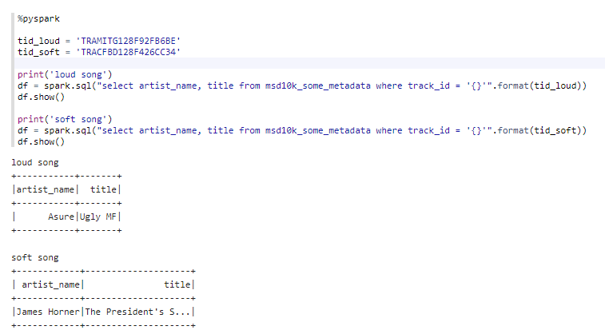

... und die Lieder anschließend in Spotify "akustisch" verglichen:

> (laut) Asure - 'Ugly MF'
>
> gegen
>
> (leise) James Horner - 'The President's Speech - Instrumental'

Hier sind auch die entsprechenden YouTube-Links: (auf YouTube ist aber zu beachten, dass die Laustärke auch von der Songqualität der hochgeladenen Datei abhängen kann.)

>(laut) https://www.youtube.com/watch?v=2RGNj54j5s8
>
>(leise) https://www.youtube.com/watch?v=48a_nR5Xnlw

Das Ergebnis war deutlich. 'Ugly MF' hat so hohe Loudness, dass die Musik stark übersteuert klingt. Das andere Lied dagegen klingt sehr leise und ruhig, sodass es auch zu keiner digitalen Übersteuerung kam. Unser Ergebnis spiegelt sich auch in den Metadaten wieder:

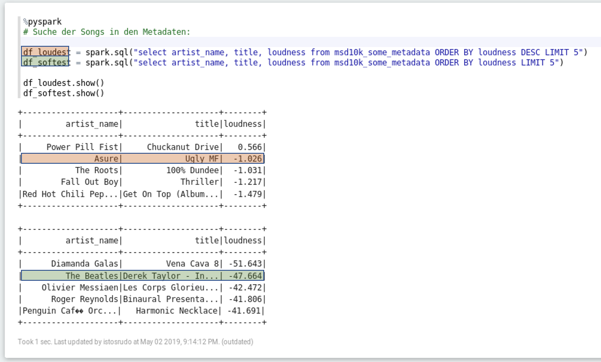

## Aufgabe 5

Bins fester Breite lohnen sich, wenn man Informationen zur Verteilung gewinnen möchte. In diesem konkreten Fall für Aufgabe 4 war es durchaus sehr hilfreich, dass die bins in fester Breite erstellt wurden, um zwischen soften und lauten Songs zu unterscheiden.
Bins fester Breite sind nicht unbedingt zur verteilten Berechnung gut geeignet. Zur verteilten Berechnung sind gleichstark gefüllte Bins zu bevorzugen, dies kann bei fester Bereite bereits schon passieren, wäre aber nur Zufall.

Wenn wir uns die Verteilung der `timbre_0` anschauen, dann stellen wir fest, dass Bins fester Breite zur verteilten Berechnung nicht sinnvoll siind.

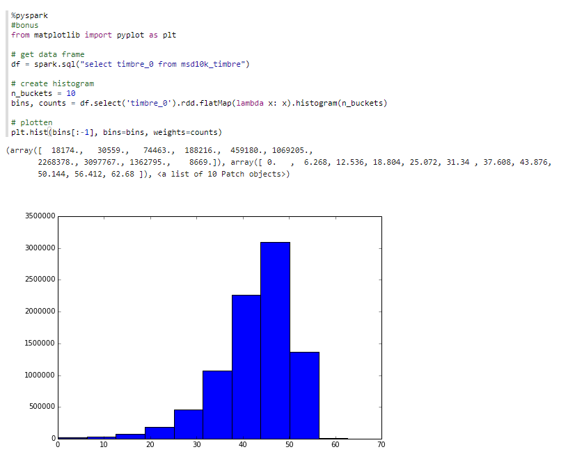

Nutzen wir approximative Quantile, dann erhalten wir folgendes Binning (für 10% Quantile):

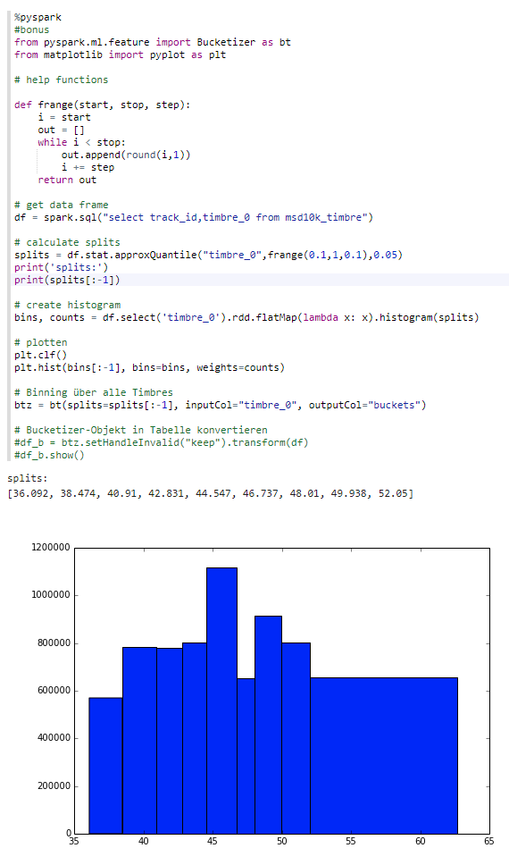
