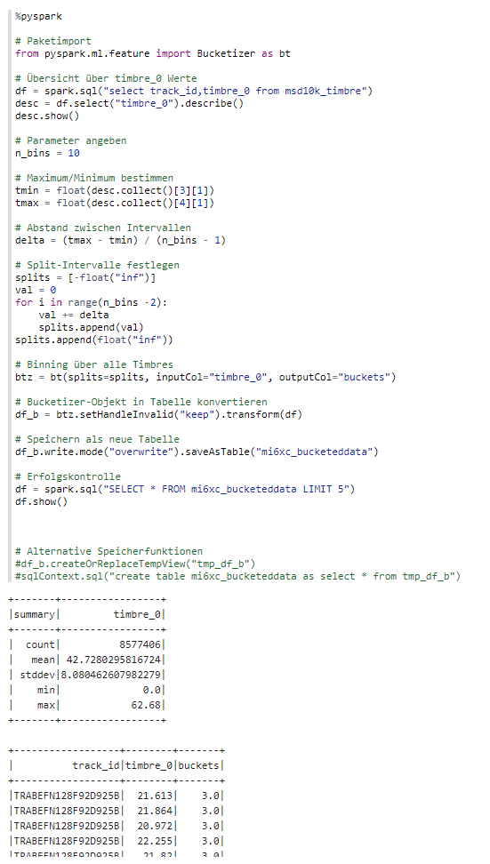
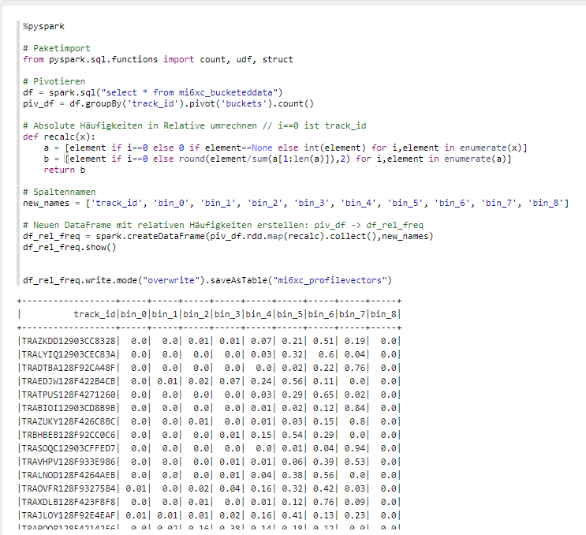

# BDA, Praktikumsbericht 1

Gruppe mi6xc: Alexander Kniesz, Maximilian Neudert, Oskar Rudolf

---

## Aufgabe 1

Zuerst haben wir ein gemeinsames Notebook [bericht1](https://141.100.62.87:7070/#/notebook/2EB5CTTRT) auf Zeppelin mit Ownern aller Gruppenmitgliedern erstellt, auf dem wir gemeinsam arbeiten können.

Wir haben als ApplicationID `app-20190425183601-0341` erhalten und uns auf `http://141.100.62.85:8080/` die Ressourcen angeschaut. Auffällig war, dass keine Kerne zugewiesen waren. Wenn man Testweise eine Endlosschleife mit PySpark ausgeführt hat, dann ging der Status auf Waiting. Wir sind von dem Monitor noch nicht ganz überzeugt. Der Status wirkt ziemlich träge. Aber man kann damit gut Applications abschießen die in Jobs festhängen.

Zuerst haben wir uns alle Million Song relevanten Tabellen ausgeben lassen:

```python
%pyspark
spark.sql("show tables like 'msd10k*'").show(truncate=False)
```


Dann haben wir die Daten gesichtet:

```sql
%sql
select * from msd10k_timbre limit 100
select * from msd10k_some_metadata limit 100
select * from msd10k_more_metadata limit 100
```


Wir haben vorerst geprüft, ob die Timbre überall gleich lang sind

```python
%pyspark
s1 = 'TRAVHPV128F933E986'
s2 = 'TRAKXYJ128F42525ED'
def get_tdur(track_id):
    not_sql_df = spark.sql("select count(timbre_0) as val from msd10k_timbre where track_id = '{}'".format(track_id))
    s_tcount = not_sql_df.collect()[0]['val']
    not_sql_df = spark.sql("select duration as dur from msd10k_more_metadata where track_id = '{}'".format(track_id))
    s_duration = not_sql_df.collect()[0]['dur']
    timbre_duration = s_duration / s_tcount
    return timbre_duration

d1 = get_tdur(s1)
d2 = get_tdur(s2)

print(d2 - d1)
```

Wir haben `0.0299464126059322` als Ergebnis bekommen, was bedeutet, dass die Timbre nicht gleich lang sind.

Beispielhaft lassen wir uns für `duration` und `loudness` eine statistische Zusammenfassung mittels `describe()` geben:

```python
%pyspark
df = spark.sql("select duration,loudness from msd10k_some_metadata")
df.describe().show()
```


Beim Vergleich der Performance haben wir durch Sichtprüfung mehrer runs einmal mit `describe` einmal mit Aggregationsfunktionen column based und row based verglichen und kamen zum Ergebnis, dass row based langsamer läuft.


## Aufgabe 2

### a)

Wir haben folgende Joins erstellt:


### b)

Die Merkmale der Daten liegen in Dimeonsions (qualitativ, diskret) und Measures (quantitativ, stetig) vor und diese existieren als eines von float, integer, date & time, date oder string.
Es existieren Merkmale mit fehlenden Werten, zum Beispiel das Jahr, welches eine `0` bekommt, falls fehlend.


Für die Anzahl an Datensätzen pro Jahr kann man die TrackIDs pro Jahr zählen lassen.


## Aufgabe 3

### a)

Für das Binning haben wir 10 bins gewählt, diese mit PySpark erstellt und und exemplarisch die Tabelle zeigen lassen. Wir haben festgestellt, dass der Bucketizer binning betreibt, indem dieser eine Spalte hinzufügt, in der die Zuordnung zu einem bin steht.



Gespeichert haben wir die Tabelle dann als `mi6xc_bucketeddata` und zur Sicherheit den Speichervorgang überprüft.


Anschließend haben wir die Pivotierung durchgeführt.


