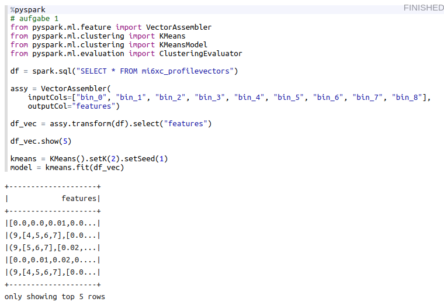
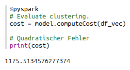
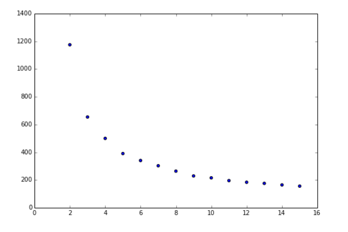
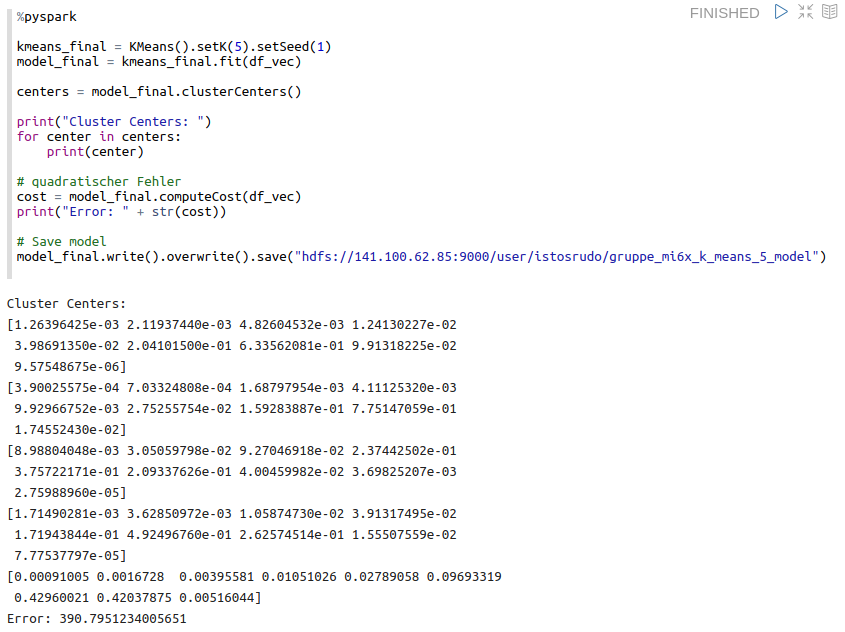
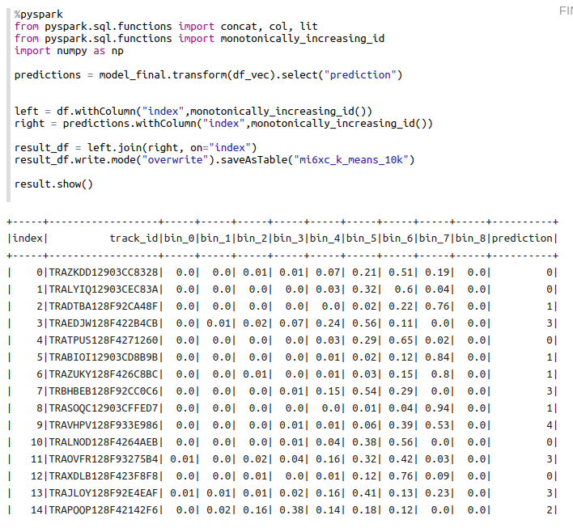
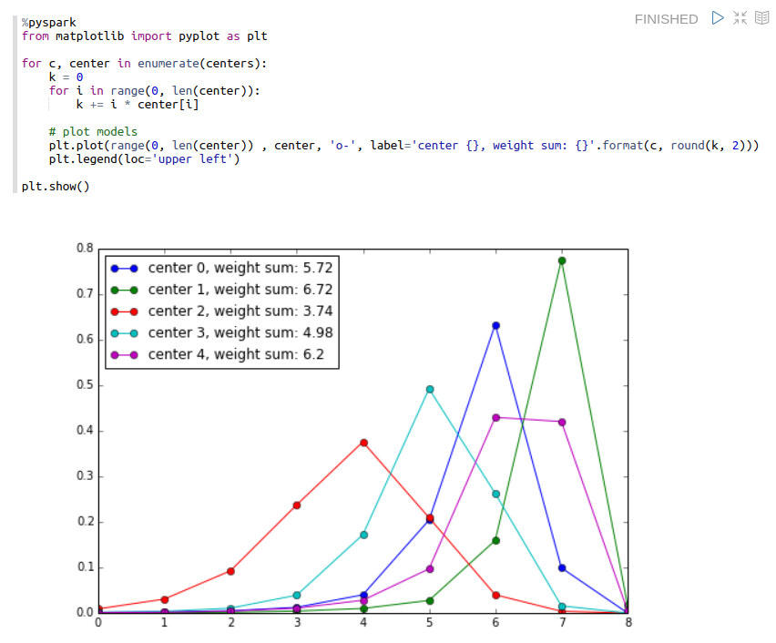
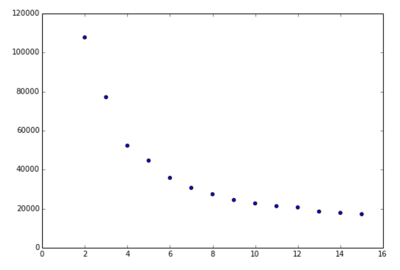

# BDA, Praktikumsbericht 2

Gruppe mi6xc: Alexander Kniesz, Maximilian Neudert, Oskar Rudolf

---

## Aufgabe 1

Zuerst sollen wir ein Clustering auf der 10k-Stichprobe machen.
Die KMeans Methode von `pyspark.ml` erwartet dazu ein DataFrame mit genau einer Spalte oder ein DataFrame mit einer Spalte `features`. Um dies zu ermöglichen transformieren wir die `bin_x` Spalten mit einem `VectorAssembler` zu einer feature Spalte, in der die vorherhigen Spalten die Dimensionen der neuen Vektoren sind.
Dabei ist zu beachten, dass `VectorAssembler` je nach Speicherauslastung automatisch sparse oder voll wählt und in unserem Fall werden es sparse Vectoren, das heißt scho mal, dass wir sehr viele 0 Werte haben.
Anschließend erstellen wir ein KMeans object `KMeans().setK(2).setSeed(1)` durch angabe der gewünschten Clusteranzahl und Start Seed und fitten damit dann das Modell anhand des neuen DataFrames.

Als quadratischen Fehler erhalten wir für die Wahl an Centroiden:

Plotten wir die quadratischen Fehler im Bereich 2 bis 16 (Anzahl an Centroiden), so erhalten wir folgenden Plot:

Die Elbow Methode ist nun, dass man schaut, wo die Steigung sich kaum noch signifikant ändert. Wir entscheiden uns für 5 Cluster, da von 4 bis 5 noch ein signifikanter Sprung ist und danach tut sich nicht mehr viel.

Um mit den Daten in Tableau arbeiten zu können erstellen wir eine neue Tabelle mit den Profilvektoren und einer weiteren Spalte mit der zugehörigen Clusternummer für unser Modell.

Um sich unter den Clusten etwas vorstellen zu können, kann man diese einmal als Verlauf plotten und eine gewichtete summe über die Bins berechnen:

Man sieht so etwas wie eine Art Loudness Profil pro Cluster.

## Aufgabe 2

Wir übertragen nun die Arbeit aus Aufabe 1.
Wichtig ist dabei nochmal mittels Elbow Methode zu prüfen, ob eventuell ein andere Anzahl an Clustern notwendig ist.

Man sieht einen kleinen Unterschied und hier würde es sich anbieten 6 Cluster zu verwenden.
