# BDA, Praktikumsbericht 2

Gruppe mi6xc: Alexander Kniesz, Maximilian Neudert, Oskar Rudolf

---

## Aufgabe 1

### a)

Zuerst sollen wir ein Clustering auf der 10k-Stichprobe machen.
Die KMeans Methode von `pyspark.ml` erwartet dazu ein DataFrame mit genau einer Spalte oder ein DataFrame mit einer Spalte `features`. Um dies zu ermöglichen transformieren wir die `bin_x` Spalten mit einem `VectorAssembler` zu einer feature Spalte, in der die vorherhigen Spalten die Dimensionen der neuen Vektoren sind.
Dabei ist zu beachten, dass `VectorAssembler` je nach Speicherauslastung automatisch sparse oder voll wählt und in unserem Fall werden es sparse Vectoren, Das heißt, dass wir sehr viele 0 Werte haben.
Anschließend erstellen wir ein KMeans object `KMeans().setK(2).setSeed(1)` durch Angabe der gewünschten Clusteranzahl (k=2) und des Start-Seeds und fitten damit dann das Modell anhand des neuen DataFrames.

### b)

Als quadratischen Fehler erhalten wir für die Wahl an Centroiden:

### c)

Plotten wir die quadratischen Fehler im Bereich 2 bis 16 (Anzahl an Centroiden), so erhalten wir folgenden Plot:

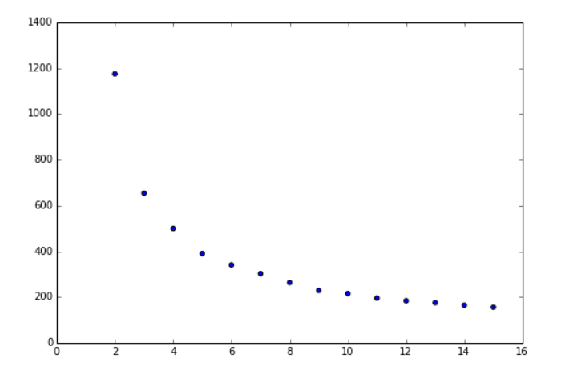

Bei dem dabei entstandenen Plot wenden wir die Elbow-Methode an, bei dir wir abschätzen, ab welcher Anzahl von Clustern sich die Steigung kaum noch ändert. Wir entscheiden uns für **5** Cluster, da der Unterschied von 4 zu 5 nach unserer Meinung noch nennenswert ist, zusätzliche Cluster ab diesem Punkt aber kaum noch Mehrwert bringen:

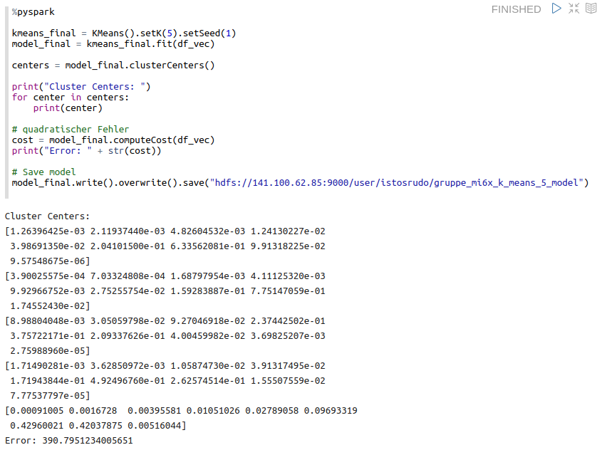

### d)

Anwendung unseres Cut-Off-Kriteriums k=5 auf den k-means-Algorithmus und abspeichern des resultierenden Modells:

### e) - f )

Um mit den Daten in Tableau arbeiten zu können erstellen wir eine neue Tabelle mit den Profilvektoren einerseits und den aus dem Modell berechneten Predictions andererseits. Die so erstellte Tabelle zeigt uns nun für jeden Track eine zugehörige Clusternummer:

Anschließend haben wir die Tabelle mit den restlichen Daten in Tableau verbunden verbunden:

### g)

Bevor wir zur Visualisierung in Tableau übergehen, haben wir zunächst noch in Python ein anschauliches Modell zur Vergleich der Cluster-Laustärkeprofile geplottet. Dieses berechnet sich aus der gewichteten Summe über die Bins:

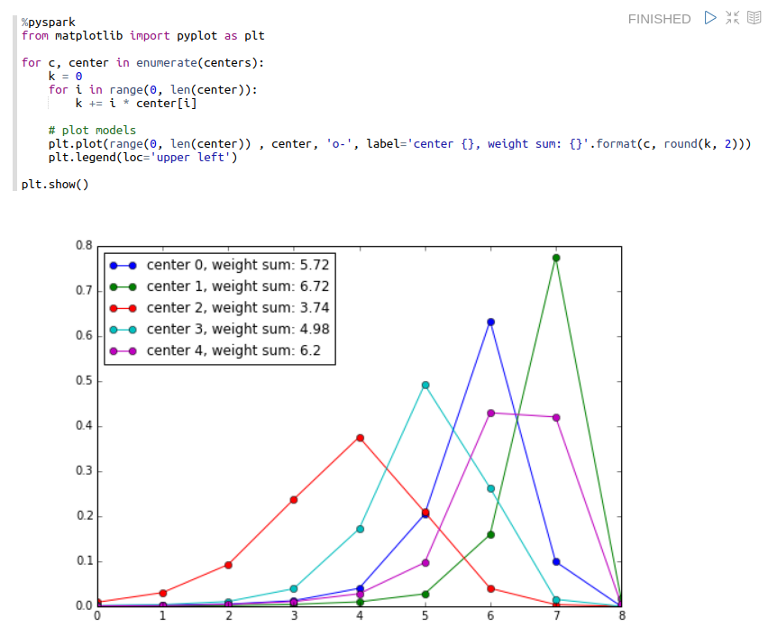

Der resultierende Plot gibt uns eine Auskunft über die Laustärkeprofile, die unsere Cluster repräsentieren.

### Tableau

#### Plot 1

Plot 1 dient einer einfachen Übersicht der Songs und deren Zuordnung zu den Clustern. Streng genommen wäre eine zusätzliche Farbkodierung der Cluster nicht notwendig gewesen, allerdings viel uns auf, dass die Unterscheidung auf den ersten Blick mit unterschiedlichen Farbstufen um einiges schneller geht, als die Unterscheidung zwischen Schwarzen Balken.

#### Plot 2

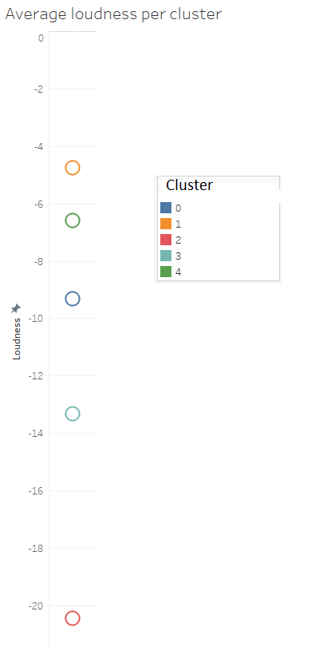

Da es sich bei den Timbre_0 um die Laustärke der Segmente handelt, drängte sich gleich die Frage auf, wie sich die Cluster bezüglich der durchschnittlichen Lautstärke aus den Metadaten entschieden. Auskunft darüber gibt uns Plot 2.

#### Plot 3

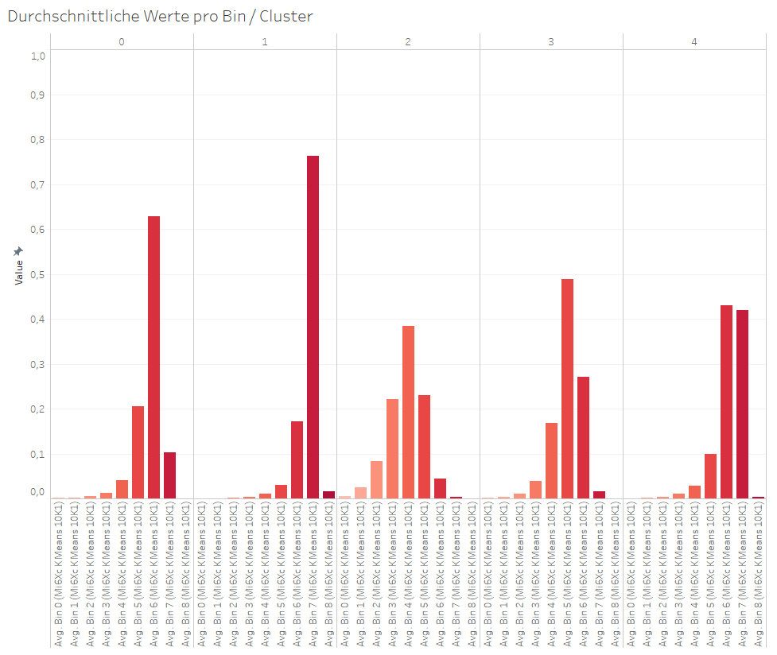

In Plot 3 sehen wir, wie in der Aufgabe vorgeschlagen, die durchschnittlichen Bins pro Cluster. Auffällig ist, dass Cluster Nr. 1 die meisten lauten Segmente zu haben scheint, d.h. dessen Verteilung am Stärksten nach rechts verschoben ist.

#### Plot 4

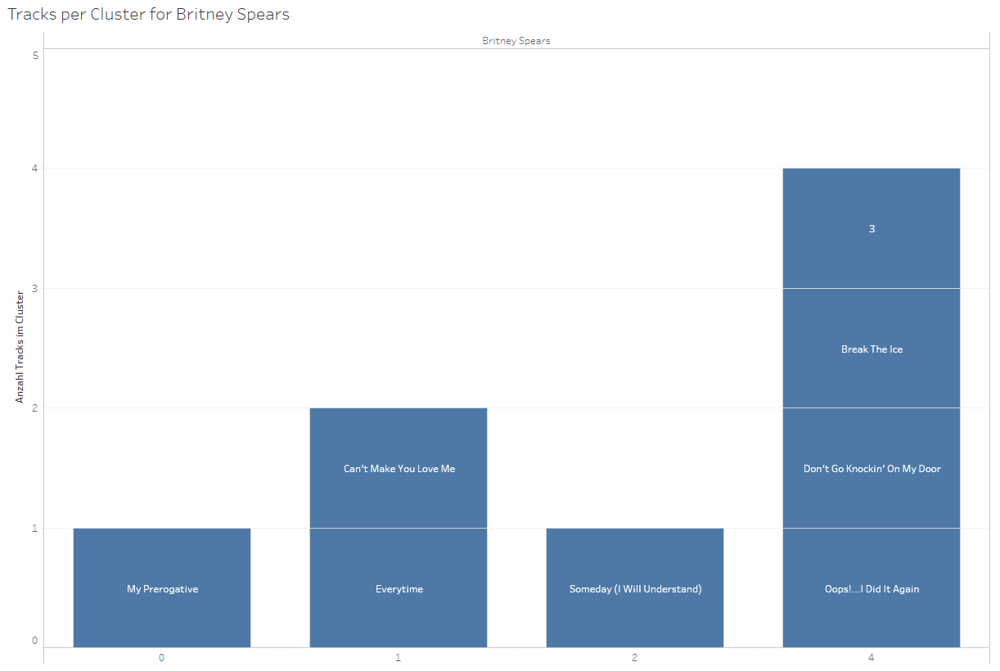

Nach langer Diskussion darüber, welche/r Künstler/in ausgesucht wird, präsentieren wir nun in Plot 4 die in Cluster aufgeteilten Songs der US-amerikanischen PopSängern "Britney Spears" (\*2. Dezember 1981 in McComb, Mississippi)). In den Balken sind die Songtitel zu sehen (Soundproben unter Aufgabe h))

#### Plot 5

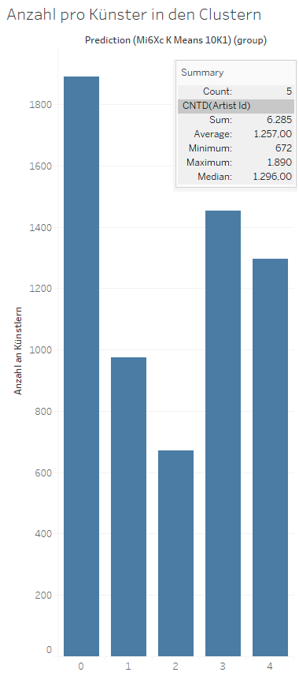

#### Plot 6

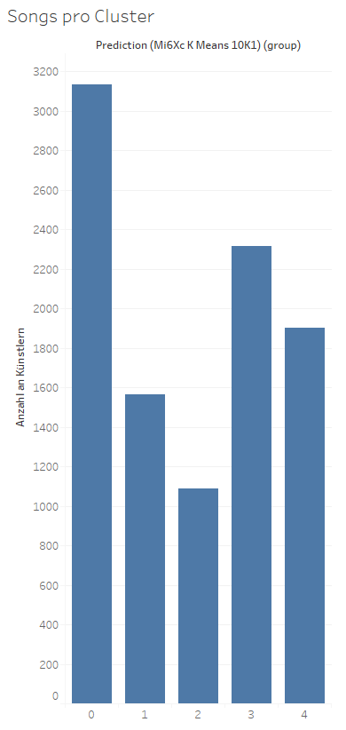

Plots 5 & 6 zeigen einfach, wie viele Künstler bzw. Titel im Cluster vertreten sind. Zum Vergleich: Insgesamt gibt es 3380 Künstler und 10000 Songtitel.

#### Plot 7

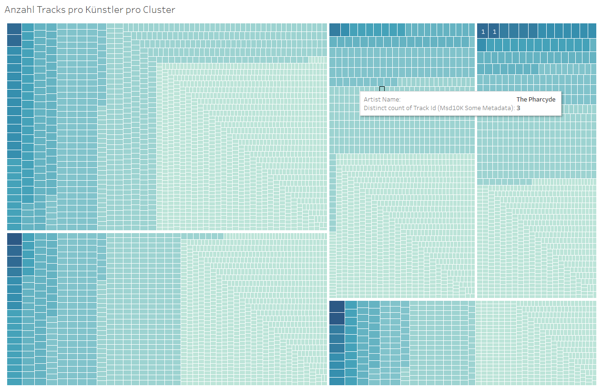

Im 7. Plot ist die Information aus 5 & 6 in einer einzigen Grafik zusammengefasst. Die "großen" 5 Mosaiksteine entsprechen den fünf Clustern. Jedes kleinere Mosaik entspricht einem Künstler und die Größe bzw. Farbe dieses Rechtecks sagt aus, wie viele Songs dieses Künstlers in diesem Cluster auftauchen. Auch hier hilft die zusätzliche Farbkodierung auf ein schon dargestelltes Merkmal **deutlich** bei der Unterscheidung der einzelnen Bestandteile der Grafik.

#### Plot 8

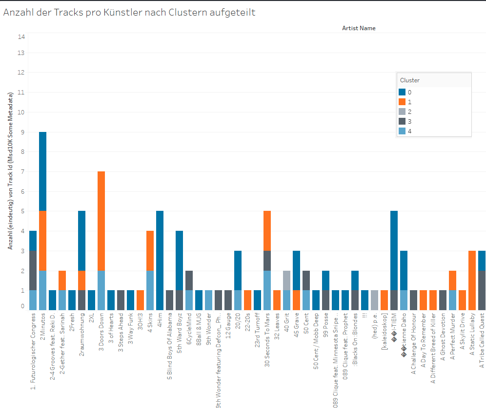

Die Informationen aus Plot 7 sind hier in Form eines Balkendiagramms noch einmal dargestellt. Hier ist die Anzahl der Songs pro Künstler pro Cluster aufsummiert dargestellt. Die Farben entsprechen den folgenden Clustern: (hellblau: 0; grau: 1; hellgrau: 2; orange:3; blau:4)

#### Plot 9

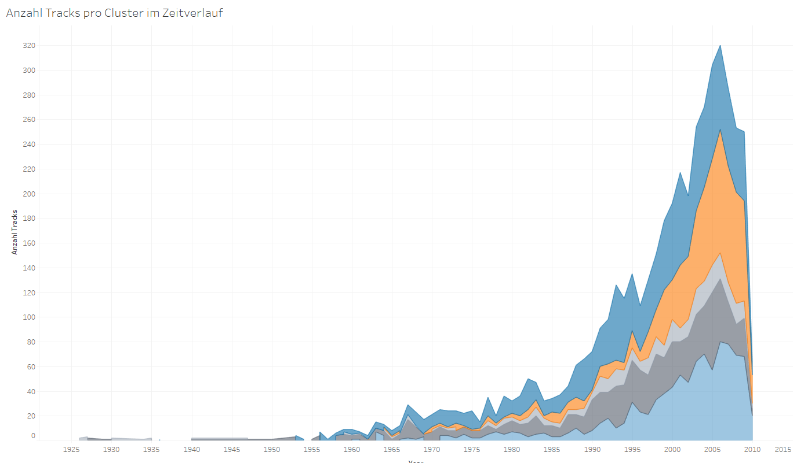

Dieser letzte Plot stellt die Anzahl Songs Pro Cluster im Zeitverlauf dar. Es gilt zu beachten, dass die Flächen nicht hintereinander liegen, sondern die aufsummierte Anzahl wiederspiegeln.

### h)

Als Hörproben haben wir verschiedene Songs von einer ausgewählten Künstlerin (**Britney Spears**) angehört, die nach unserer Analyse in verschiedenen Clustern liegen und daher unterschiedliche Lautstärkeprofile haben sollten.

[Cluster 0:](https://www.youtube.com/watch?v=dIOH8Trfas4&ab_channel=BritneySpearsVEVO "Britney Spears - My Prerogative") "My Prerogative" // Mittlere Lautstärke und Tempo

[Cluster 1:](https://www.youtube.com/watch?v=8YzabSdk7ZA&ab_channel=BritneySpearsVEVO "Britney Spears - Everytime") "Everytime" // Ist ein relativ sanfter Song

[Cluster 2:](https://www.youtube.com/watch?v=kBtBfGxNqpY&ab_channel=BritneySpearsVEVOO "Britney Spears - Someday (I Will Understand)") "Someday (I Will Understand)" // Auch eher sanft und ruhig

Cluster 3: keine Songs im Clustervorhanden

[Cluster 4:](https://www.youtube.com/watch?v=CduA0TULnow&ab_channel=BritneySpearsVEVO "Britney Spears - Oops!...I Did It Again (Official Video)") "Oops!...I Did It Again" // Dieser Song ist etwas lauter

Überraschenderweise ist der Song aus Cluster 1 (nach Plot 2 das im durchschnitt lauteste Cluster) relativ leise. Die Songlautstärken aus den anderen Clustern scheinen allerdings der "Clusternorm" zu entsprechen.

## Aufgabe 2

Wir übertragen nun die Arbeit aus Aufabe 1 a)-c).
Wichtig ist dabei nochmal mittels Elbow Methode zu prüfen, ob eventuell ein andere Anzahl an Clustern notwendig ist.

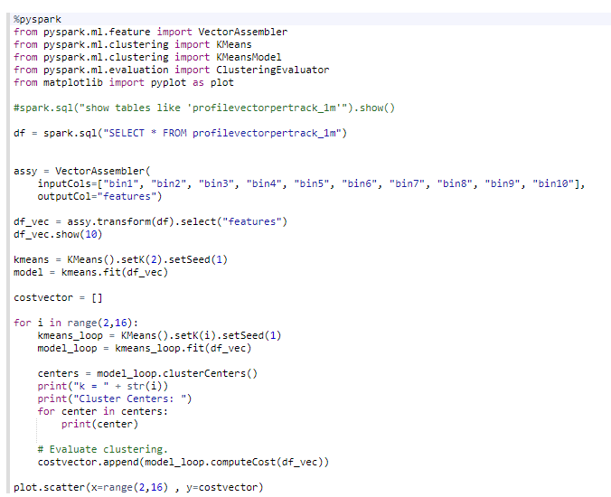

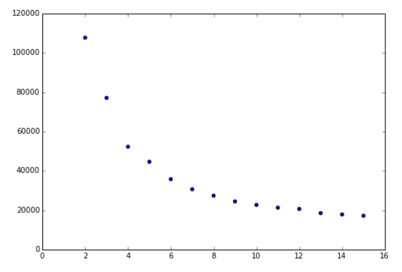

Man sieht einen kleinen Unterschied und hier würde es sich anbieten 6 Cluster zu verwenden.

Die genauen Arbeitsschritte sind im Notebook unter [Zeppelin Notebook_GruppeMi6xc](https://141.100.62.87:7070/#/notebook/2EB72FHYP") dokumentiert.

Unterschiede und Gemeinsamkeiten zwischen 10k und 1M:

Leider traten während der Übertragung der Tableau-Worksheets auf den 1m-Datensatz Probleme mit dem Sparkcluster auf und die Queryzeiten verschoben sich auf über eine Stunde (Abbrechen ging auch nicht mehr, Tableau musste per `kill` geschlossen werden). Es war uns aus diesem Grund nicht möglich, die Unterschiede und Gemeinsamkeiten zwischen den Datensätzen herauszuarbeiten.
