# BDA, Praktikumsbericht 3

Gruppe mi6xc: Alexander Kniesz, Maximilian Neudert, Oskar Rudolf

---

<script type="text/javascript" src="http://cdn.mathjax.org/mathjax/latest/MathJax.js?config=TeX-AMS-MML_HTMLorMML"></script>
<script type="text/x-mathjax-config">
    MathJax.Hub.Config({ tex2jax: {inlineMath: [['$', '$']]}, messageStyle: "none" });
</script>

## Quellen

Das PySpark Notebook findet man [hier](https://141.100.62.87:7070/#/notebook/2ECVJRCPX).

## Aufgabe 1

Wir lesen das `txt` file als DataFrame ein. Anschließend kann man mit `withColumn` diverse Operationen auf den Spalten ausführen.
Das DataFrame enthält alle Zeilen des `txt` Files als Zeilen. In unserem Fall haben wir die Daten zuerst bereinigt, sprich Sonderzeichen und leere Zeilen entfernt.
Anschließend haben wir mittels `split` die Strings in den Zeilen in Wörter Arrays umgewandelt, danach die Arrays mit `explode` in weitere Zeilen erweitern und abschließend MapReduce mit `lit` und `groupBy` gemacht.

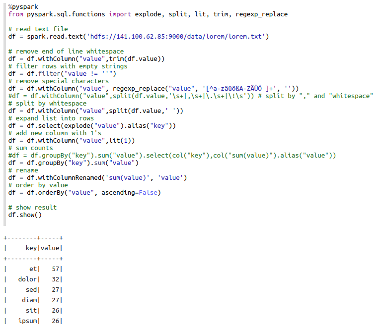

<div style="page-break-after: always;"></div>

## Aufgabe 2

Wir verbinden uns mittels ssh auf:

```bash
141.100.62.87
```

dort haben wir eine `tmux` session mittels

```bash
tmux -S /tmp/smux new -s amo
```

erstellt, auf die wir uns dann mittels

```bash
tmux -S /tmp/smux attach -t amo
```

gemeinsam verbinden und mit netcat arbeiten können.

### Code

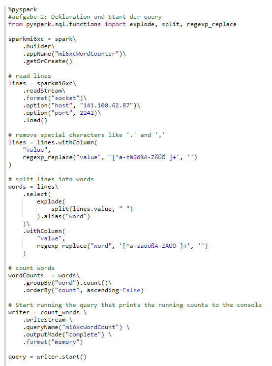

### unterschiede in den Parameters

`outputMode` besitzt folgende Paramter:

- **append**: Nur neue Zeilen werden in den Output geschrieben. Exklusiv für de Verwendung ohne Aggregationen.
- **complete**: Alle Zeilen werden jedes mal in den Output geschrieben. Exklusiv für die Verwendung mit Aggregationen.
- **update**: Nur veränderte Zeilen werden in den Output geschrieben. Ohne Aggregation wie **append**.

und `format` besitzt unter anderem folgende Parameter:

- **console**: Schreibt den verarbeiteten Stream in die Console sprich in den Standard Output.
- **memory**: Schreibt den verarbeiteten Stream in eine in Memory Datenbank. Folglich für große Datenmengen eher ungeeignet.

### Testergebnisse

Wir haben die ersten 100 Wörter von Lorem Ipsum ein paar mal über `netcat` abgesendet und erhalten folgendes Ergebnis:

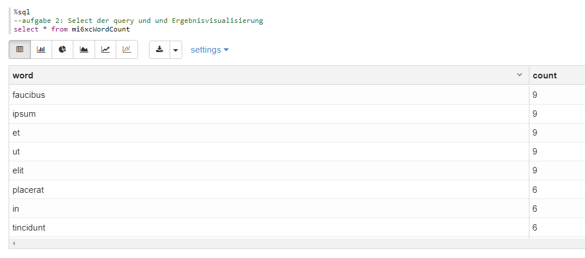

Wir modifizieren die query, indem wir die Splits anpassen, neue Spalten generieren und anschließend `url` auswählen und mit dieser gruppieren und zählen.

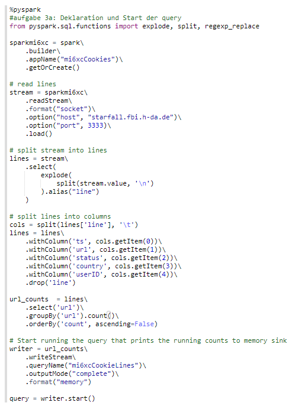

Wir erhalten damit folgendes exemplarisches Ergebnis:

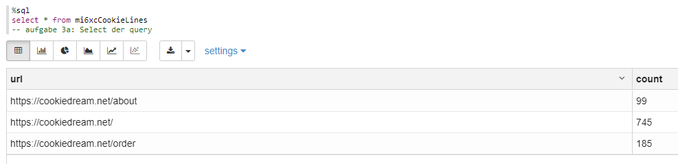

<div style="page-break-after: always;"></div>

## Aufgabe 3

### a)

Sliding windows lassen sich durch die `sql` Funktion `window` im `groupBy` Befehl erstellen.

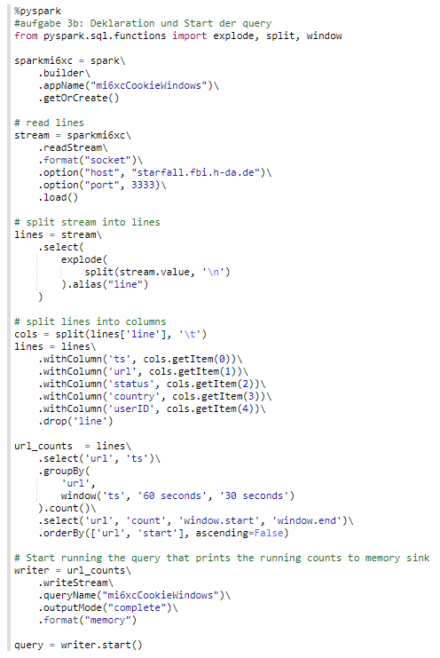

### b)

Tabellarisch erhalten wir folgenden Output sortiert nach url und Startzeit des Windows:

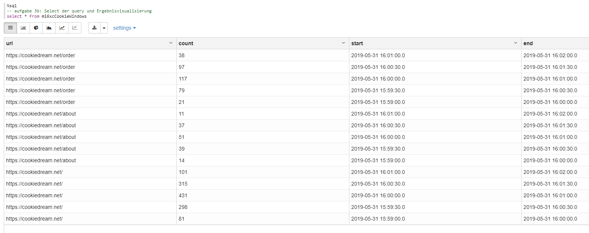

Visualisiert man zum Beispiel mit einer Barchart ohne irgendwelche Einstellungen, so erhält man die Counts abhängig von der URL.

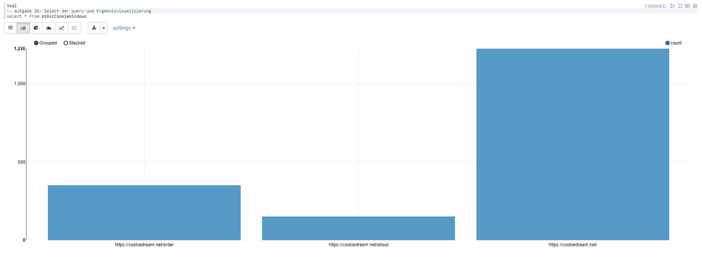

Unter settings kann man dann ähnlich wie mit Tableau Daten gruppieren und aggregieren. Ein schöner Plot ergibt sich zum Beispiel, indem man mit der Startzeit des Windows zusätzlich gruppiert:

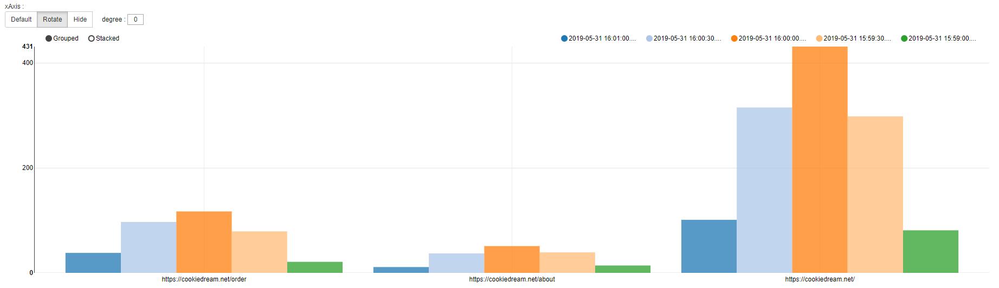

Im Prinzip macht es nur wirklich Sinn in diesem Fall `start` und `url` zwischen `keys` und `groups` zu tauschen. Ein weiterer schöner Graph ist `start` als Key und `url` als Group stacked.

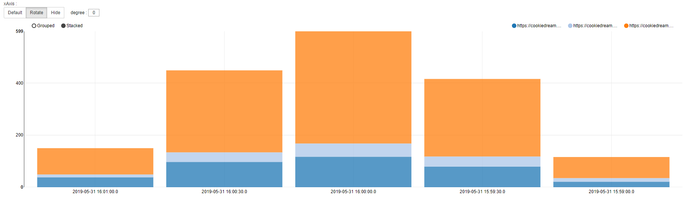

<div style="page-break-after: always;"></div>

## Aufgabe 4

### a)

Als Modifikation fügen wir eine weitere Spalte zur Gruppierung hinzu.

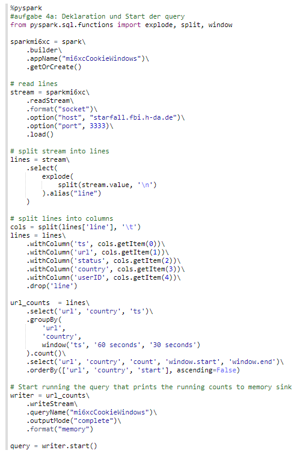

Zuerst einmal aus Interesse gesichtet, wie die Verteilung der Länder ist.

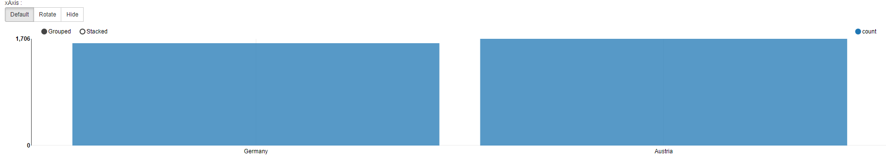

Dies kann man dann um die Länder erweitern.

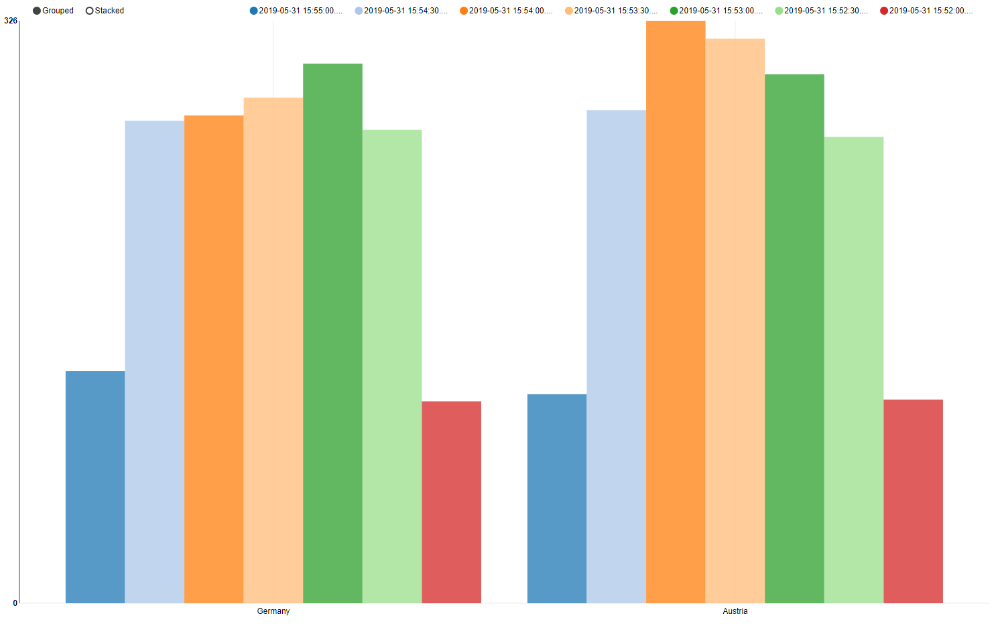

Und schlussendlich um die URLs mit den Ländern als Gruppierung.

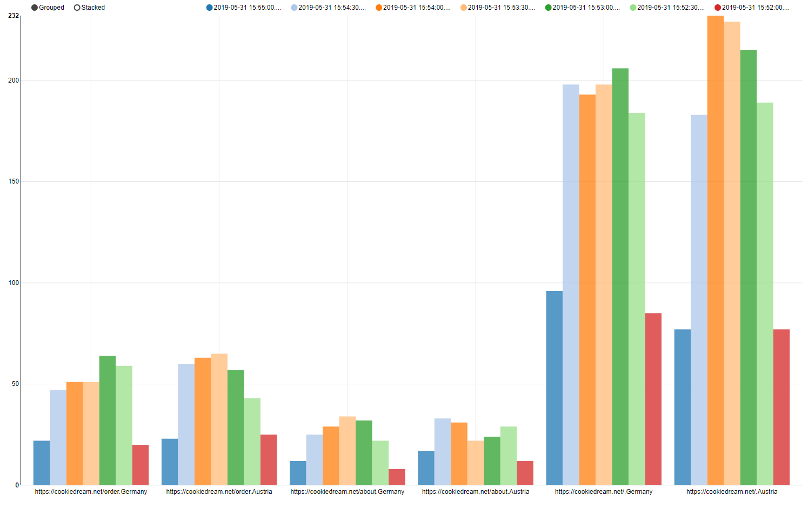

Dann erkennt man zum Beispiel, dass die meisten Aufrufe aus Österreich auf die Basisseite um 15:54 bis 15:55 waren.

### b)

Wir bauen einen Filter mit `lines.country == 'Germany'` und ersetzen `country` mit `status`.

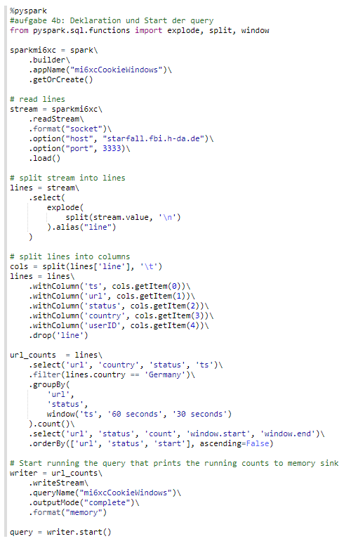

Anschließend erhalten wir folgendes Ergebnis:

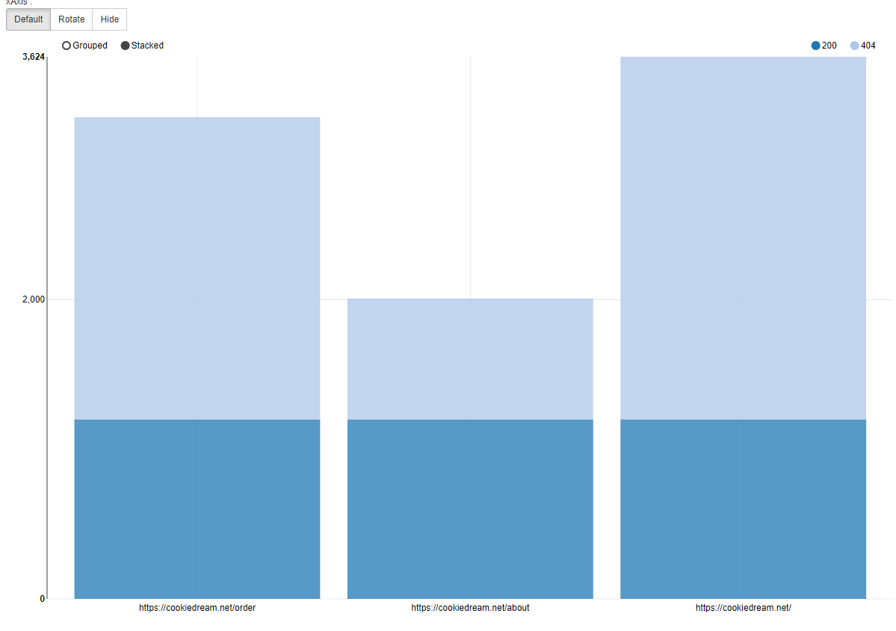

Man sieht, dass `order` und `root` in `Germany` deutlich öfter `404` sprich nicht gefunden werfen als `about`.

### c)

Zu den Unterschiedenlichen Ausgabemodi muss man zuerst daran denken, dass `append` (ohne Watermarks) nicht auf aggregierten Daten funktioniert, `complete` nur auf aggregierten Daten funktioniert und `update` nicht mit Sortierung funktionier. Deshalb haben wir die ersten beiden Aufgaben mit `complete` bearbeitet.

Late Data bedeutet, dass Daten mit einem späteren Eventzeitpunkt ankommen als deren Timestamp.
Zur Bearbeitung von Late Data gibt es in Spark `watermarks`, welche mit `.withWatermark("timestamp", "threshold")` definiert werden können. Dabei ist `timestamp` die Eventzeit und `threshold` die maximale Zeit, die Daten zu spät sein dürfen (zum Beispiel `60 seconds`). Kommen nun Daten später an als der angegebene Threshold an, so werden diese nicht mehr für das Fenster aggregiert.

Arbeitet man mit Aggregation ohne Watermarks, so gibt es folgende Möglichkeiten für Late Data:

- Complete: Es werden grundsätzlich alle Daten für die Output Sink mit einbezogen und entsprechend aktualisiert. Späte Daten werden damit auch verarbeitet, da alle Daten inklusive der späten Daten zum Triggerzeitpunkt aggregiert werden.
- Update: Im Gegensatz zu Complete werden zum Triggerzeitpunkt alle neuen Daten zu den Alten aggregiert, somit auch späte Daten.

Arbeitet man mit Aggregation und mit Watermarks, so gibt es folgende Möglichkeiten für Late Data (Complete ist nicht mehr sinnvoll, da für Complete alle Daten für die Output Sink zu erhalten sind, aber man mit Watermarks gerade zu späte Daten ignorieren möchte.):

- Append: Zum Triggerzeitpunkt werden Daten noch bis zum Ende des angegebenen Delay Threshold gesammelt und dann gemeinsam zur Output Sink hinzugefügt. Alle Daten, die danach ankommen, werden ignoriert.
- Update: Zu jedem Triggerzeitpunkt werden die Daten in der Output Sink aktualisiert. Daten, deren Timestamp noch innerhalb des angegebenen Thresholds liegen werden dazu mit einbezogen, während Daten, die außerhalb liegen ignoriert werden.

Das heißt, dass die Output Sink mit Append später aktualisiert wird, dafür weniger Zeilenoperationen nötig sind und somit der Aufwand sinkt, während Update die Output Sink zu jedem Triggerzeitpunkt aktualisiert aber höheren Aufwand dafür besitzt.
