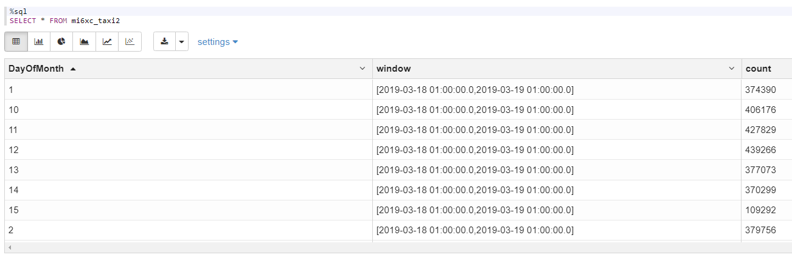
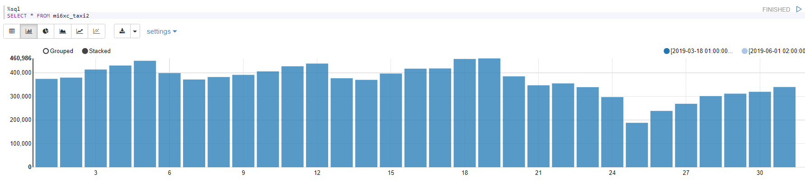
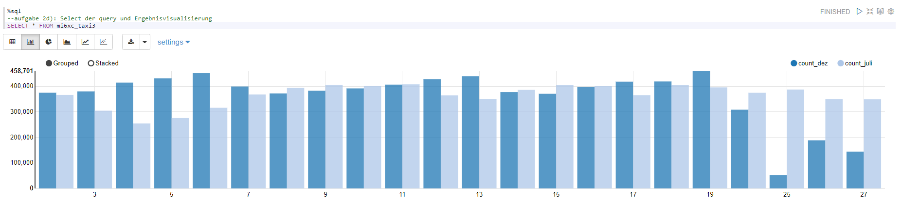
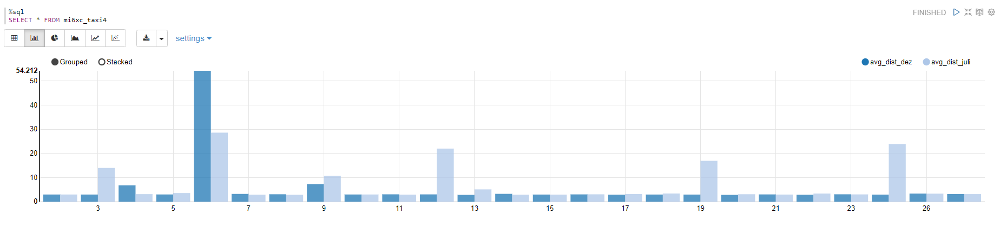
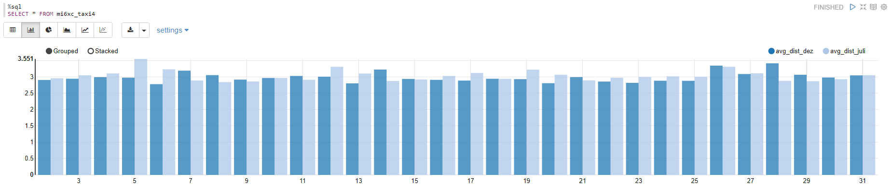

# BDA, Praktikumsbericht 4

Gruppe mi6xc: Alexander Kniesz, Maximilian Neudert, Oskar Rudolf

---

<script type="text/javascript" src="http://cdn.mathjax.org/mathjax/latest/MathJax.js?config=TeX-AMS-MML_HTMLorMML"></script>
<script type="text/x-mathjax-config">
    MathJax.Hub.Config({ tex2jax: {inlineMath: [['$', '$']]}, messageStyle: "none" });
</script>

## Quellen

Das PySpark Notebook findet man [hier](https://141.100.62.87:7070/#/notebook/2ED5PXGC4).

## Aufgabe 1

### a)

Zuerst verbinden wir uns auf eine Node, die als producer dienen soll, zum Beispiel `saltshore`:

```bash
mosh istuser@saltshore.fbi.h-da.de
```

anschließend wechseln wir in das Verzeichnis mit den vorbereiteten Scripts und starten den producer:

```bash
cd /opt/kafka/bin
./kafka-console-producer.sh --broker-list saltshore.fbi.h-da.de:9092 --topic bda-gruppe3-topic
```

Analog gehen wir vor, verbinden uns auf eine andere Node, wechseln in den Ordner und starten den consumer, der sich zum Producer zunächst ohne `--form-beginning` verbindet:

```bash
mosh istuser@sunspear.fbi.h-da.de
cd /opt/kafka/bin
./kafka-console-consumer.sh --bootstrap-server saltshore.fbi.h-da.de:9092 --topic bda-gruppe3-topic
```


Wenn wir beim Producer nun Nachrichten schreiben, dann werden diese mit kurzer Verzögerung vom Consumer empfangen und dort auf der Console ausgegeben.
Fügen wir nun zusätzlich den Parameter `--form-beginning` hinzu, so erhalten wir erwartungsgemäß alle Nachrichten, die bisher auf dem angegebenen Topic gesendet wurden.
Da wohl ein paar Spaßvögel mit Scripts das Topic geflutet haben dauert das sogar eine Weile auszugeben.


### b)

Schauen wir uns die Spalten der Kafka Ausgabe per SQL an


so sehen wir, dass wir neben `key` und `value` auch eine Reihe an Metadaten wie `timestamp`, `topic` und `partition` erhalten.

<div style="page-break-after: always;"></div>

Starten wir die WordCount Query

```python
%pyspark
#aufgabe 1b): Deklaration des Kafka-Consumer-Streams und Start der query

from pyspark.sql.functions import explode
from pyspark.sql.functions import split

# read text file
lines = spark \
.readStream \
.format("kafka") \
.option("kafka.bootstrap.servers", "141.100.62.88:9092") \
.option("subscribe", "bda-gruppe3-topic") \
.option("startingOffsets", "earliest") \
.option("kafkaConsumer.pollTimeoutMs", "8192") \
.load()

# cast value object to string
lines = lines\
    .withColumn("value", lines.value.cast('string'))\
    .select('value')

# split lines into words
words = lines\
    .select(explode(split(lines.value, " "))\
    .alias("word"))

# count words
count_words  = words\
    .groupBy("word").count()\
    .orderBy("count", ascending=False)

# Start running the query that prints the running counts to memory sink
writer = count_words \
    .writeStream \
    .queryName("mi6xc_kafkawords") \
    .outputMode("complete") \
    .format("memory")

query = writer.start()
```

<div style="page-break-after: always;"></div>

so erhalten wir folgendes Ergebnis:


# Aufgabe 2

## a)

Zunächst haben wir die Daten gesichtet:


Anschließend haben wir die Daten als SparkDataFrame importiert und mit Hilfe der `month` und `dayofmonth-` Funktionen den jeweiligen Monat und Tag als seperate Spalten hinzugefügt. Danach konnten wir nach dem 7. Monat filtern und die Anzahl der Zeilen gruppiert nach Monatstagen zählen:


## b)

Nach Filtern & Zählen der Daten überprüften wir, ob soweit alles geklappt hat:


## c)

Zunächst prüfen wir wieder über ssh, ob wir als `Subscriber` die Taxidaten einsehen können. Dazu verbinden wir uns auf eine der Nodes führen

```bash
cd /opt/kafka/bin
./kafka-console-consumer.sh \
--bootstrap-server 141.100.62.85:9092 \
--topic yellow_tripdata_2015_12 \
--from-beginning
```

aus und erhalten:


Das hat soweit geklappt. Jetzt abonnieren wir diesen Stream mit Spark und folgenden Optionen:

```python
# read text file
df = spark \
  .readStream \
  .format("kafka") \
  .option("kafka.bootstrap.servers", "141.100.62.88:9092") \
  .option("subscribe", "yellow_tripdata_2015_12") \
  .option("startingOffsets", "earliest") \
  .option("kafkaConsumer.pollTimeoutMs", "8192") \
  .option("maxOffsetsPerTrigger",1000000) \
  .load()
```

Da die Datenpunkte hier zeilenweise als Strings in den Stream fließen, müssen wir die Zeilen, mit einem `split`-Befehl aufteilen.
Da uns zunächst "nur" die Timestamps interessieren, wählen wir hier nur das zweite Element aus dem gespliteten Datenpunkt.
Anschließend nutzen wir aus, dass die Funktion `dayofmonth` auch String-Datentypen als input akzeptiert und wir mittels dieser Funktion wieder den Monatstag extrahieren können.
Damit die Wochentage übereinstimmen, wollen wir im Folgenden den Mittwoch, 1. Juli (`Data at Rest`) mit Mittwoch, dem 2. Dezember (`Data in Motion`) vergleichen. Dafür generieren wir eine zusätzliche Spalte mit versetztem "Day of Month".

```python
# extract datetimes
datetime_df = df\
  .withColumn('datetimes', split(df.value, ",").getItem(1)) # 1. Item = tpep_pickup_datetime

datetime_df = datetime_df\
  .withColumn('DayOfMonth', dayofmonth(datetime_df.datetimes))

datetime_df = datetime_df \
  .withColumn("DayToJoin", datetime_df.DayOfMonth +1)
```

Jetzt können wir die Daten einfach wieder nach Monatstag (analog zu 2b) ) und mit einem Window über die timestemps (mit size = 24 Studnen) aggregieren und zählen:

```python
# count
aggregated  = datetime_df \
  .groupBy("DayOfMonth", window(datetime_df.timestamp,"24 hours"))\
  .count() \
  .orderBy("count", ascending=False)

writer2 = aggregated \
  .writeStream \
  .queryName("mi6xc_taxi2") \
  .outputMode("complete") \
  .format("memory")

query2 = writer2.start()
```

Damit erhalten wir zum als Output:




## d)

Wir lesen für die Join-Operation zunächst die Juli-Daten wieder ein und führen dann mithilfe der entsprechenden SpakDataFrame-Methode einen InnerJoin durch:

```python
# Sommerdaten
juli_df  = spark.sql("select * from mi6xc_julidata")

# Join Operation
all_data = datetime_df.join(juli_df, datetime_df.DayToJoin == juli_df.DayOfMonth)
```

Die Aggregation funktioniert analog zu 2c). Hier müssen wir lediglich noch beachten, dass aufgrund des joins zwei `DayOfMonth` Spalten existieren und wir deshalb die eindeutige Spalte `DayToJoin` als Gruppierungsvariable verwenden.
Zusätzlich müssen wir die `count` Spalten entsprechend umbennen.


```python
# Winterdaten
datetime_df = df\
  .withColumn('datetimes', split(df.value, ",").getItem(1))

datetime_df = datetime_df\
  .withColumn('DayOfMonth', dayofmonth(datetime_df.datetimes))

datetime_df = datetime_df \
  .withColumn("DayToJoin", datetime_df.DayOfMonth +1)

df_count_dez  = datetime_df \
  .groupBy("DayToJoin", window(datetime_df.timestamp,"24 hours"))\
  .count() \
  .orderBy("count", ascending=False) \
  .selectExpr("count as count_dez", "DayToJoin as day")

# Sommerdaten
df_count_juli  = spark.sql("select * from mi6xc_julidata") \
  .selectExpr("count as count_juli", "DayOfMonth as day")

# Join Operation
df_count_all = df_count_dez.join(df_count_juli, df_count_dez.day == df_count_juli.day)

writer3 = df_count_all \
  .writeStream \
  .queryName("mi6xc_taxi3") \
  .outputMode("complete") \
  .format("memory")

query3 = writer3.start()
```

und visualisieren das Ergebnis:



Spontan liegt die Vermutung nahe, dass an wichtigen Feiertagen weniger Taxi gefahren wird. Denn sowohl der 4. Juli als auch Weihnachten sind wichtige Feiertage der USA und dort ist jeweils ein starker Einbruch verglichen zu beobachten.

## e)

Das Vorgehen ist äquivalent zu `d)`, allerdings müssen wir die entsprechenden Variablen von Interesse aus dem Input-Stream extrahieren und als Spalte in unseren SparkDataFrame hinzufügen:

```python
datetime_df = df\
  .withColumn('trip_distance', split(df.value, ",").getItem(4)) # 4. Item = Trip_Distance
```

Anschließend können wir nach dieser Variablen gruppieren und alle möglichen gewünschten Aggregationsfunktionen darauf anwenden (wir haben `mean` angewendet)

- `avg`
- `count`
- `max`
- `mean`
- `min`
- `sum`

```python
%pyspark
# Aufgabe 2e)

from pyspark.sql.functions import split
from pyspark.sql.functions import window
from pyspark.sql.functions import month, dayofmonth, col

df = spark \
  .readStream \
  .format("kafka") \
  .option("kafka.bootstrap.servers", "141.100.62.88:9092") \
  .option("subscribe", "yellow_tripdata_2015_12") \
  .option("startingOffsets", "earliest") \
  .option("kafkaConsumer.pollTimeoutMs", "8192") \
  .option("maxOffsetsPerTrigger",1000000) \
  .load()

# Winderdaten
df_dez = df\
  .withColumn('datetimes', split(df.value, ",").getItem(1)) \
  .withColumn('trip_distance', split(df.value, ",").getItem(4))
df_dez = df_dez\
  .withColumn('DayOfMonth', dayofmonth(df_dez.datetimes))
df_dez = df_dez\
  .withColumn("DayToJoin", df_dez.DayOfMonth +1)

df_dist_dez  = df_dez \
  .groupBy("DayToJoin", window(df_dez.timestamp,"24 hours")) \
  .agg({'trip_distance': 'mean'}) \
.withColumnRenamed("avg(trip_distance)", "mean") \
  .selectExpr("mean as avg_dist_dez", "DayToJoin as day")

# Sommerdaten
df_juli  = spark.sql("SELECT tpep_pickup_datetime as datetimes, trip_distance FROM yellow_tripdata")
df_juli = df_juli \
  .withColumn("Month", month("datetimes")) \
  .filter(col("Month")==7)
df_juli = df_juli \
  .withColumn('DayOfMonth', dayofmonth(df_juli.datetimes))

df_dist_juli  = df_juli \
  .groupBy("DayOfMonth") \
  .agg({'trip_distance': 'mean'}) \
.withColumnRenamed("avg(trip_distance)", "mean") \
  .selectExpr("mean as avg_dist_juli", "DayOfMonth as day")

# Join Operation
df_dist_all = df_dist_dez.join(df_dist_juli, df_dist_dez.day == df_dist_juli.day)

writer4 = df_dist_all \
  .writeStream \
  .queryName("mi6xc_taxi4") \
  .outputMode("complete") \
  .format("memory")

query4 = writer4.start()
```

Als Output bekommen wir dann:



Neben Tagen, die generell etwas höheres Aufkommen haben, fallen Ausreißer auf. Da die Daten nicht bereinigt sind, könnte dies auf Rauschen zurückführbar sein. Schauen wir in die Daten

```sql
SELECT * FROM yellow_tripdata where trip_distance > 200
```

So finden wir einige Ausreißer und ein paar absurd hohe Werte, was so viel bedeutet wie, dass in der Distanz einiges an Rauschen enthalten ist. Dies könnten defente Taxiuhren sein, die zu spät oder gar nicht gestoppt wurdern oder einfach einen Fehler bei der Datenübertragen hatten.
Es ist durchaus anzunehmen, dass es Kunden gibt, die auch weite Strecken mit dem Taxi nehmen, aber schaut man sich die Daten an, so kann man sagen, dass eine Fahrtstrecke von über 100km äußerst unwahrscheinlich ist. Also filtern wir diese heraus.

```python
df_dez = df_dez\
  .withColumn("DayToJoin", df_dez.DayOfMonth +1) \
  .filter(col("trip_distance") <= 100)

df_juli = df_juli \
  .withColumn('DayOfMonth', dayofmonth(df_juli.datetimes)) \
  .filter(col("trip_distance") <= 100)
```

Damit erhalten wir als neuen Output:


