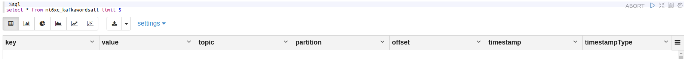
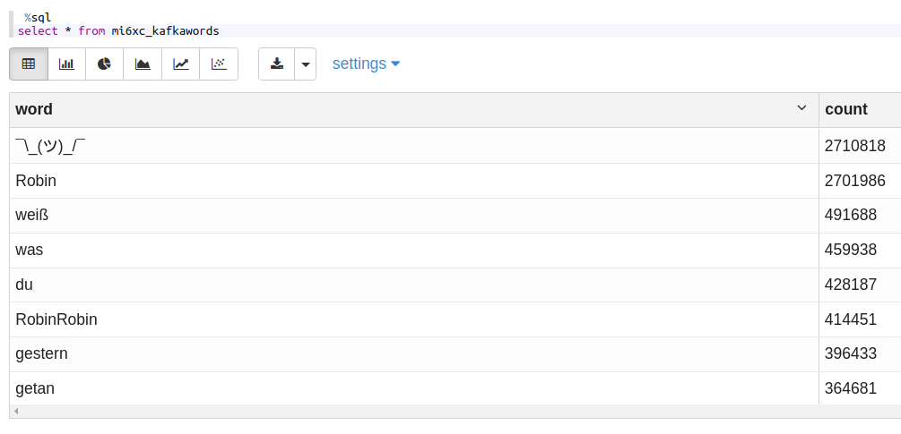

# BDA, Praktikumsbericht 4

Gruppe mi6xc: Alexander Kniesz, Maximilian Neudert, Oskar Rudolf

---

<script type="text/javascript" src="http://cdn.mathjax.org/mathjax/latest/MathJax.js?config=TeX-AMS-MML_HTMLorMML"></script>
<script type="text/x-mathjax-config">
    MathJax.Hub.Config({ tex2jax: {inlineMath: [['$', '$']]}, messageStyle: "none" });
</script>

## Quellen

Das PySpark Notebook findet man [hier](https://141.100.62.89:7070/#/notebook/2EFFKHFN5).

## Aufgabe 1

### a)

Zuerst verbinden wir uns auf eine Node, die als producer dienen soll, zum Beispiel `saltshore`:

```bash
mosh istuser@saltshore.fbi.h-da.de
```

anschließend wechseln wir in das Verzeichnis mit den vorbereiteten Scripts und starten den producer:

```bash
cd /opt/kafka/bin
./kafka-console-producer.sh --broker-list saltshore.fbi.h-da.de:9092 --topic bda-gruppe3-topic
```

Analog gehen wir vor, verbinden uns auf eine andere Node, wechseln in den Ordner und starten den consumer, der sich zum Producer zunächst ohne `--form-beginning` verbindet:

```bash
mosh istuser@sunspear.fbi.h-da.de
cd /opt/kafka/bin
./kafka-console-consumer.sh --bootstrap-server saltshore.fbi.h-da.de:9092 --topic bda-gruppe3-topic
```


Wenn wir beim Producer nun Nachrichten schreiben, dann werden diese mit kurzer Verzögerung vom Consumer empfangen und dort auf der Console ausgegeben.
Fügen wir nun zusätzlich den Parameter `--form-beginning` hinzu, so erhalten wir erwartungsgemäß alle Nachrichten, die bisher auf dem angegebenen Topic gesendet wurden.
Da wohl ein paar Spaßvögel mit Scripts das Topic geflutet haben dauert das sogar eine Weile auszugeben.


### b)

Schauen wir uns die Spalten der Kafka Ausgabe per SQL an



so sehen wir, dass wir neben `key` und `value` auch eine Reihe an Metadaten wie `timestamp`, `topic` und `partition` erhalten.

<div style="page-break-after: always;"></div>

Starten wir die WordCount Query

```python
%pyspark
#aufgabe 1b): Deklaration des Kafka-Consumer-Streams und Start der query

from pyspark.sql.functions import explode
from pyspark.sql.functions import split

# read text file
lines = spark \
.readStream \
.format("kafka") \
.option("kafka.bootstrap.servers", "141.100.62.88:9092") \
.option("subscribe", "bda-gruppe3-topic") \
.option("startingOffsets", "earliest") \
.option("kafkaConsumer.pollTimeoutMs", "8192") \
.load()

# cast value object to string
lines = lines\
    .withColumn("value", lines.value.cast('string'))\
    .select('value')

# split lines into words
words = lines\
    .select(explode(split(lines.value, " "))\
    .alias("word"))

# count words
count_words  = words\
    .groupBy("word").count()\
    .orderBy("count", ascending=False)

# Start running the query that prints the running counts to memory sink
writer = count_words \
    .writeStream \
    .queryName("mi6xc_kafkawords") \
    .outputMode("complete") \
    .format("memory")

query = writer.start()
```

<div style="page-break-after: always;"></div>

so erhalten wir folgendes Ergebnis:



# Aufgabe 2

## a)

Zunächst haben wir die Daten gesichtet:


Anschließend haben wir die Daten als SparkDataFrame importiert und mit Hilfe der `month` und `dayofmonth-` Funktionen den jeweiligen Monat und Tag als seperate Spalten hinzugefügt. Danach konnten wir nach dem 7. Monat filtern und die Anzahl der Zeilen gruppiert nach Monatstagen zählen:


## b)

Nach Filtern & Zählen der Daten überprüften wir, ob soweit alles geklappt hat:


## c)

Zunächst prüfen wir wieder über ssh, ob wir als `Subscriber` die Taxidaten einsehen können:


Das hat soweit geklappt. Jetzt übertragen wir diesen Stream auf Spark mit folgenden Optionen:


Da die Datenpunkte hier zeilenweise als Strings in den Stream fließen, müssen wir die entsprechenden Zeilen, in denen die Daten wiederum kommasepariert sind, mit einem `split`-Befehl aufteilen. Da uns zunächst "nur" die Timestamps interessieren, selektieren wir hier nur das zweite Element aus dem gespliteten Datenpunkt. Anschließend nutzen wir aus, dass die Funktion `dayofmonth` auch String-Datentypen als input akzeptiert und wir mittels dieser Funktion wieder den Monatstag extrahieren können.  Damit die Wochentage übereinstimmen, wollen wir im Folgenden den Mittwoch, 1. Juli (`Data at Rest`) mit Mittwoch, dem 2. Dezember (`Data in Motion`) vergleichen. Dafür generieren wir eine zusätzliche Spalte mit versetztem "Day of Month". 


Jetzt können wir die Daten einfach wieder nach Monatstag (analog zu 2b) ) UND nach dem Window über die timestemps (mit size = 24 Studnen) aggregieren und zählen:


## d)

Wir lesen für die Join-Operation zunächst die Juli-Daten wieder ein und führen dann mithilfe der entsprechenden SpakDataFrame-Methode einen InnerJoin durch:


Die Aggregation funktioniert analog zu 2c). Hier müssen wir lediglich noch beachten, dass aufgrund des joins zwei DayOfMonth-Spalten existieren und wir deshalb die eindeutige Spalte "DayToJoin" als Gruppierungsvariable verwendet haben.


## e)

Das Vorgehen ist äquivalent zu 2d), allerdings müssen wir die entsprechenden Variablen von Interesse aus dem Input-Stream extrahieren und als Spalte in unseren SparkDataFrame hinzufügen:


Anschließend können wir nach dieser Variablen gruppieren und alle möglichen gewünschten Aggregationsfunktionen darauf anwenden (wir haben `mean` angewendet)

- avg
- count
- max
- mean
- min
- sum

